<h1 align="center">Learnerby - find your mentor</h1>
<h6 align="center">LEARNERBY is a mentor finding web application built using MERN stack technology</h6>

---

## Table of Contents:

- [Learnerby Overview](#item1)
- [Installation Guide](#item2)
- [Screenshots](#item3)

---

## Learnerby Overview:

<h3>
LEARNERBY is web application where user can find mentors, user can book classes whenever they need and after payment they can start classes.
</h3>
-----

## Installation Guide:

- [Step 1: Download the Repository](#step1)
- [Step 2: Run the client and server](#step2)

---

### Step 1: Download the Repository

Either Clone the repository using git clone: `gh repo clone biswajittt/learnerby`
or install via <a target="_blank" href="https://github.com/biswajittt/learnerby/archive/refs/heads/master.zip">zip</a> and extract
to any of your folders you wish.

---

### Step 2: Run the client and server:

Run the client and server by using npm start

---

## Screenshots:

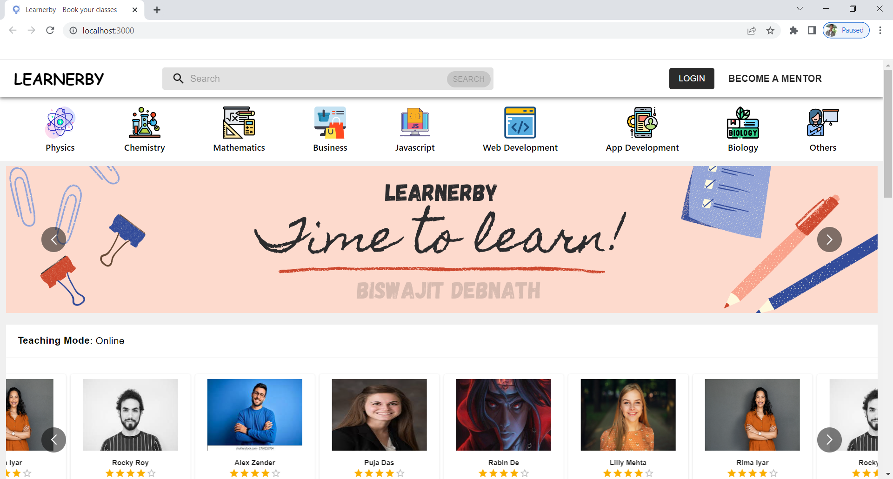
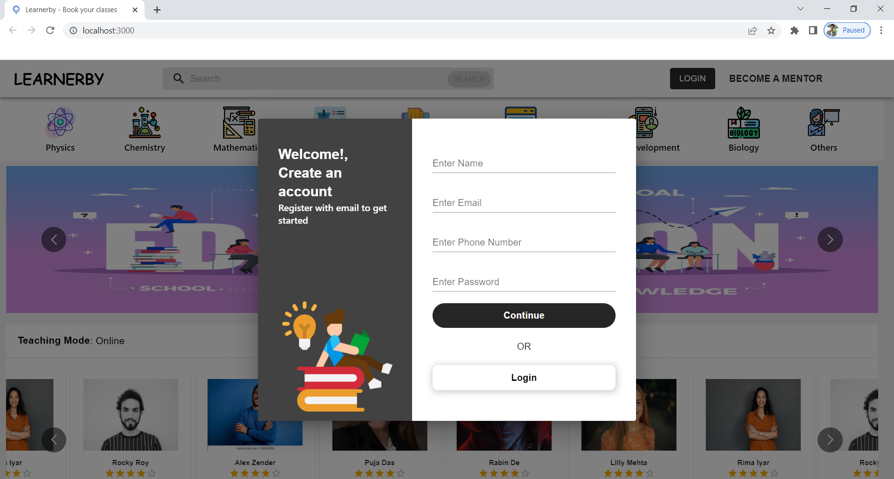
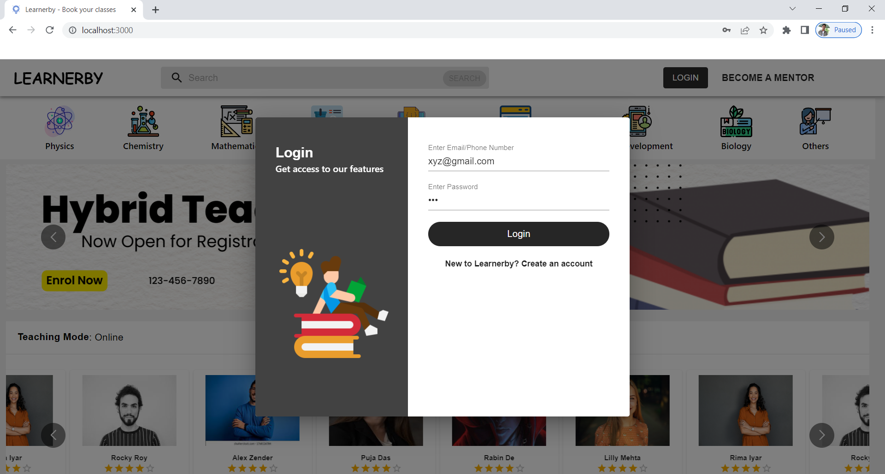
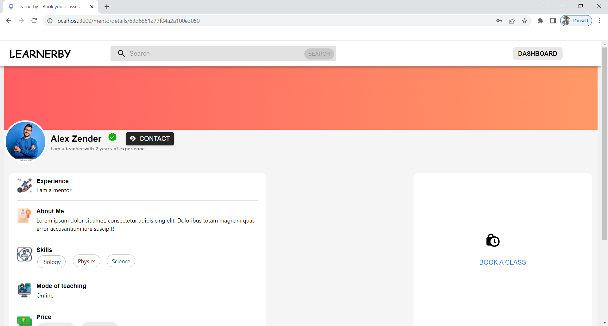
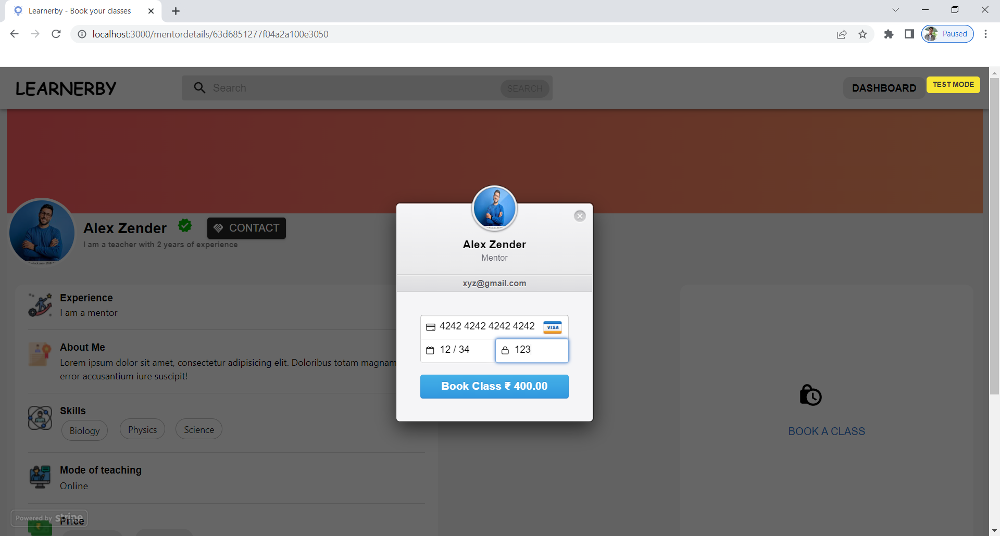
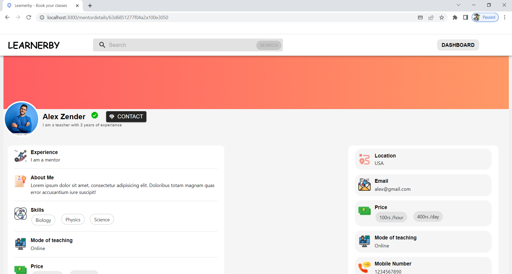
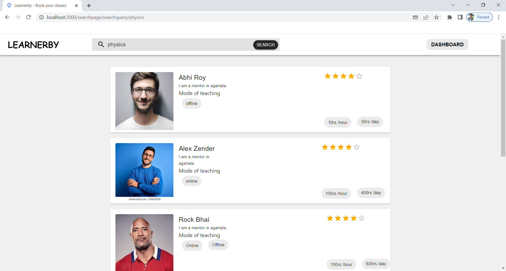
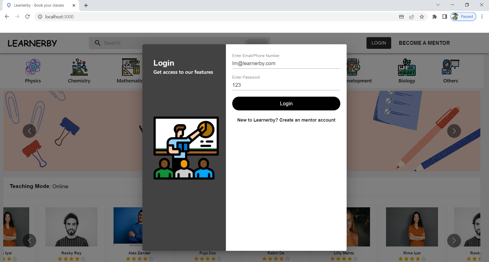
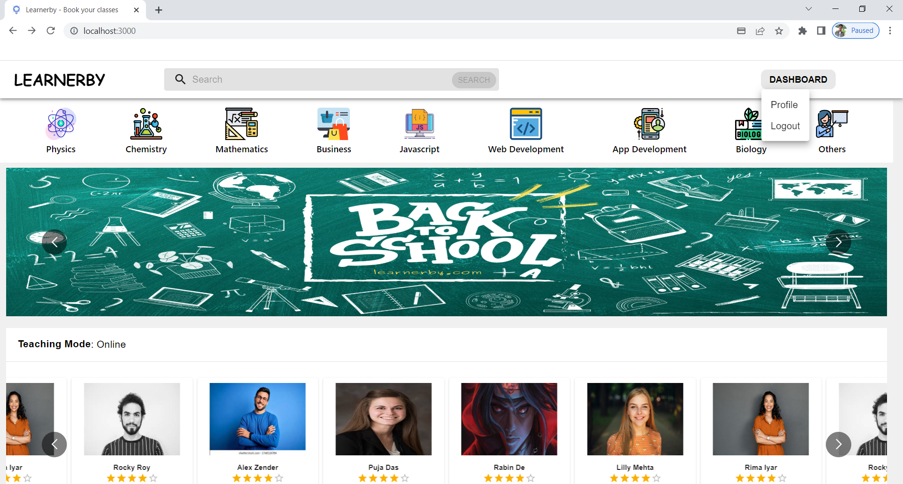
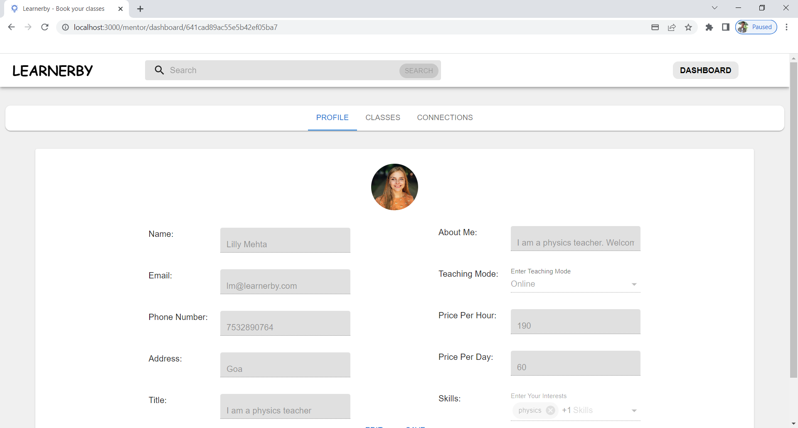
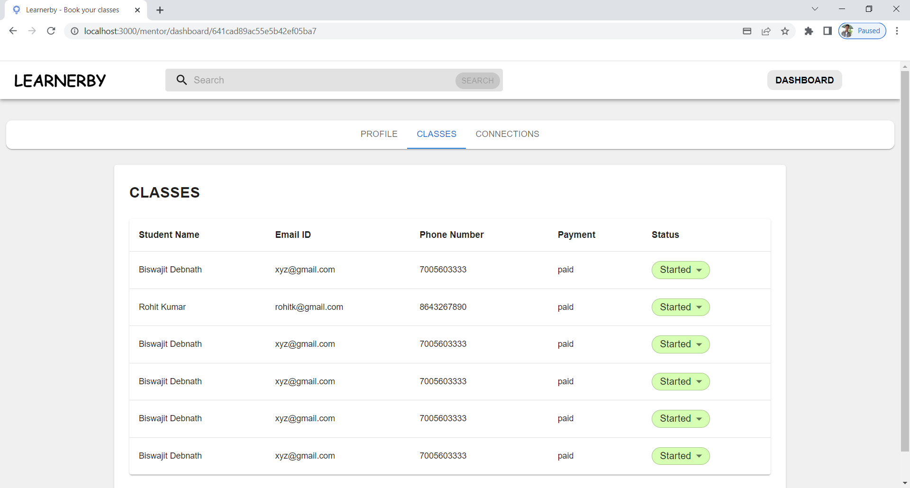
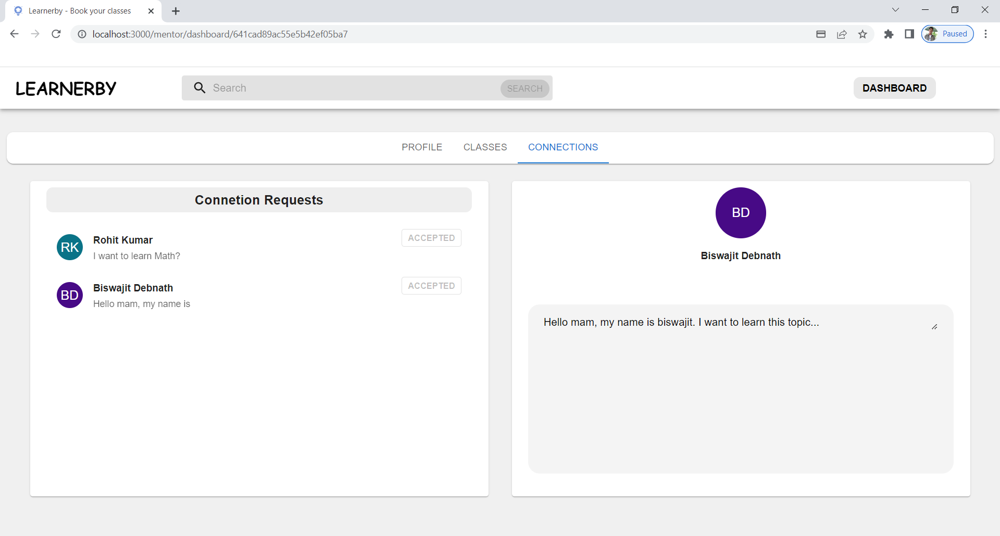
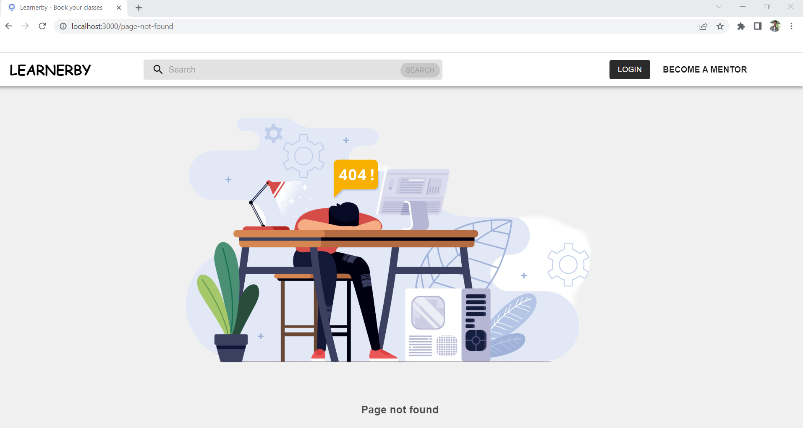
